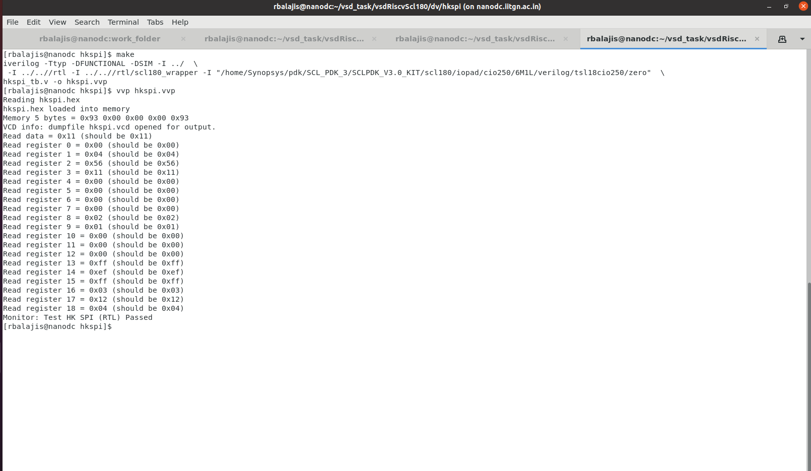
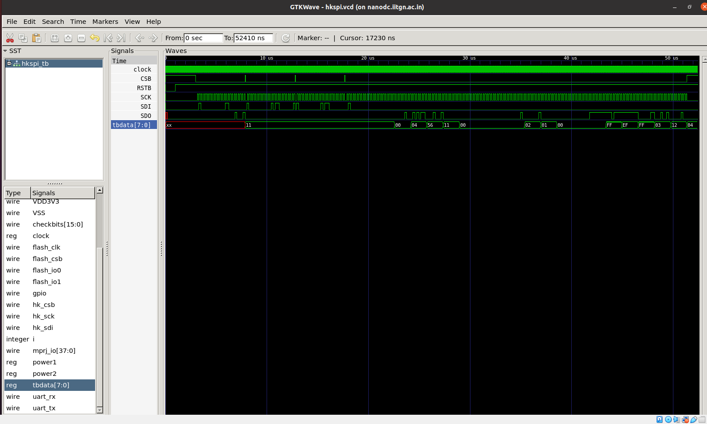

# Day 1 - RTL Simulation Vs GLS Simulation Using Synopsys

## Cloning GITHUB Files

    git clone -b iitgn https://github.com/vsdip/vsdRiscvScl180.git

## Required file:

- SCL_180 Lib
- vsdRiscvSc1180
- Synopsys
- iverilog,GTKWave

## RTL Simulation:

## Waveform:

