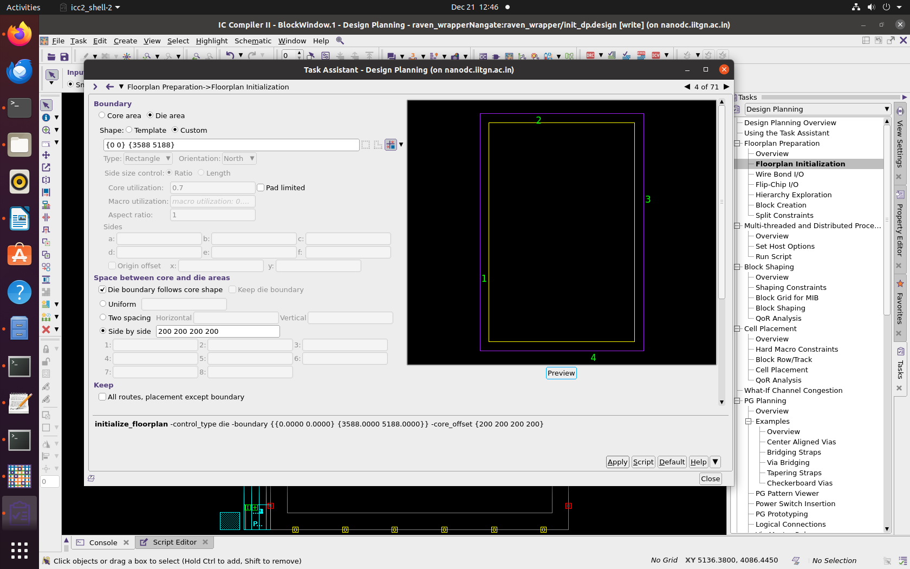
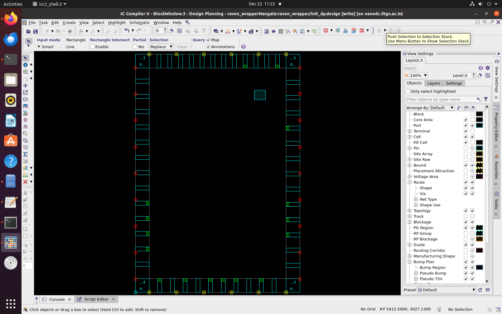
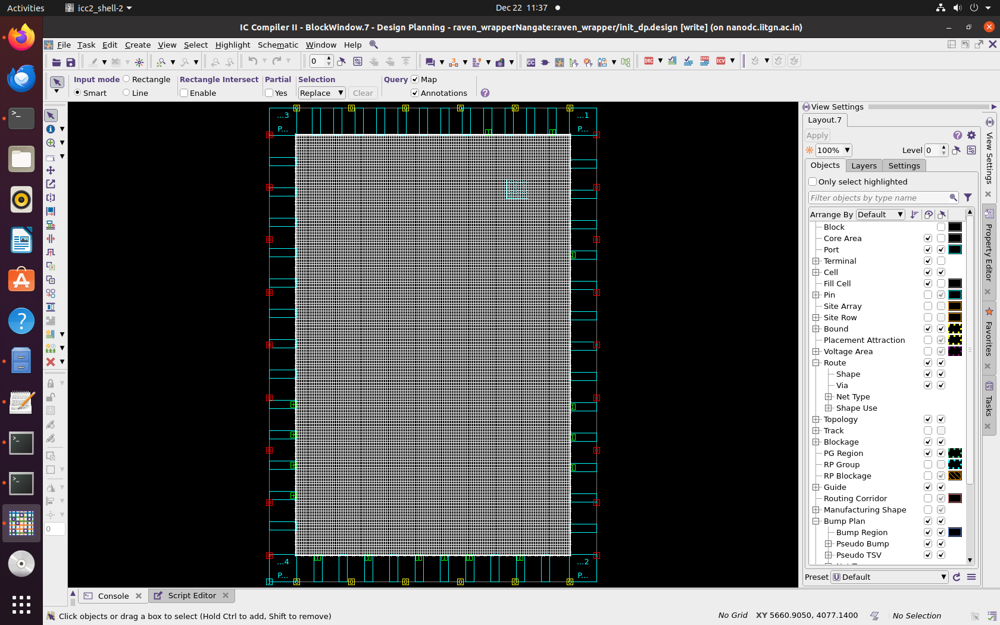
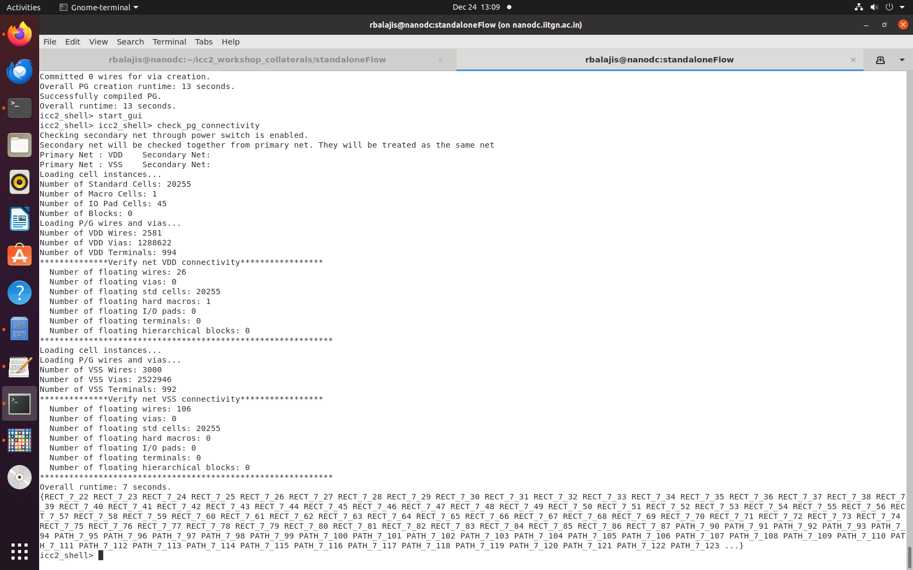
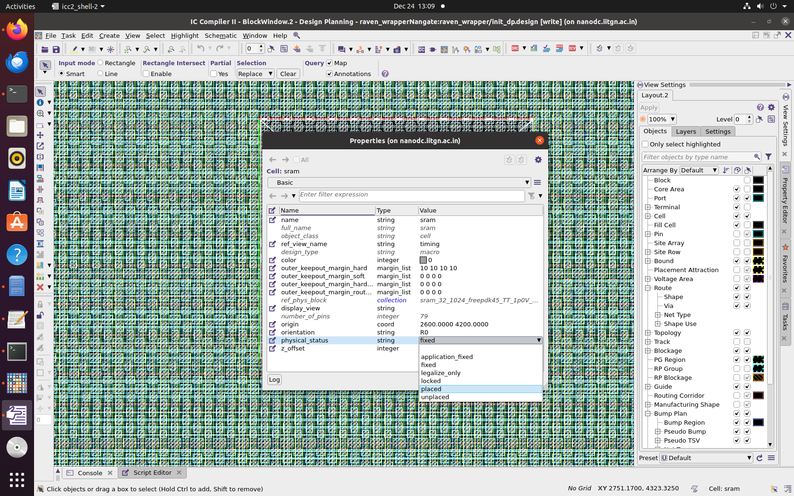
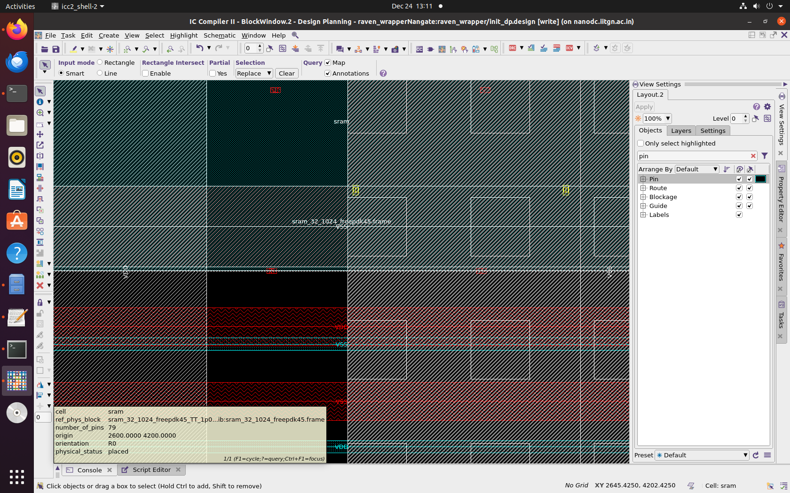
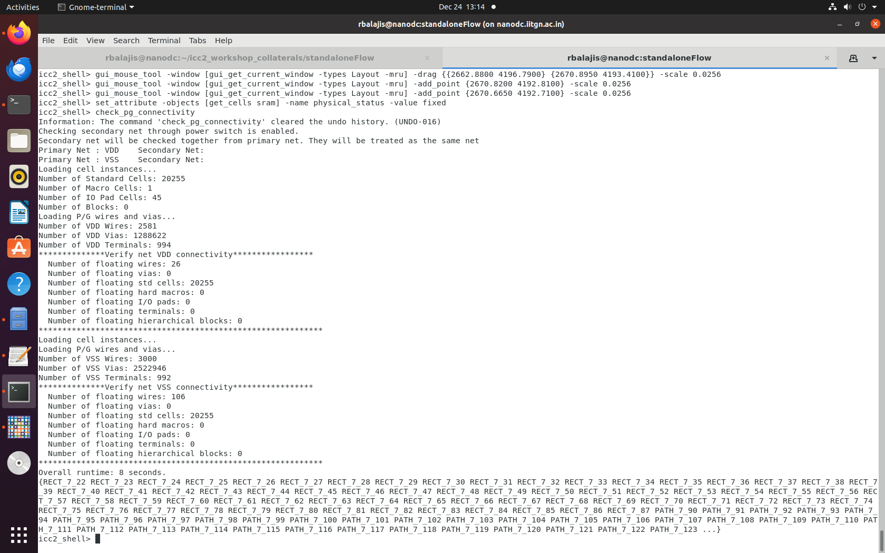
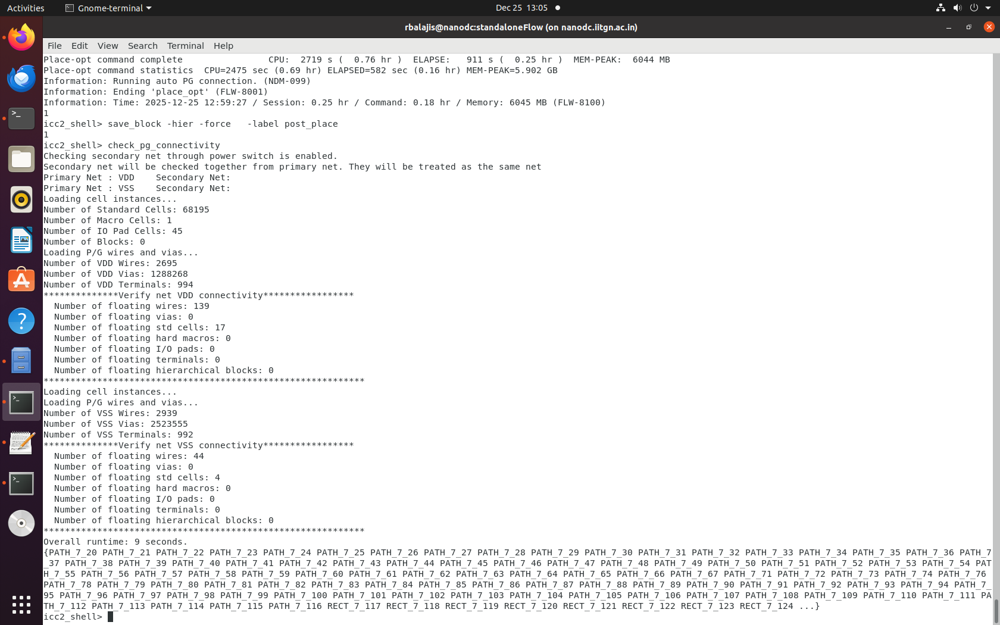
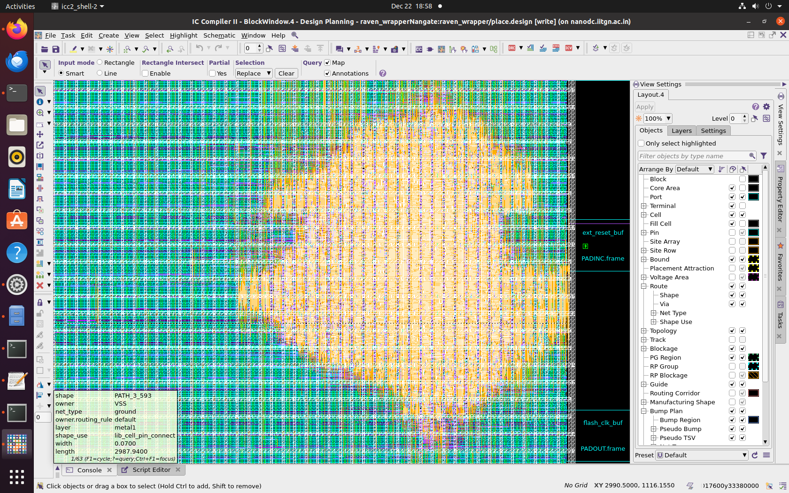
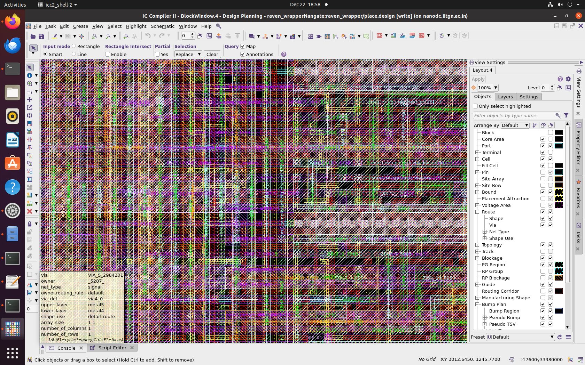

# Physical Design Flow Documentation


## Table of Contents

1. [Overview](#overview)
2. [Design Specifications](#design-specifications)
3. [Implementation Flow](#implementation-flow)
4. [Issues and Resolutions](#issues-and-resolutions)
5. [TCL Automation Scripts](#tcl-automation-scripts)
6. [Conclusion](#conclusion)

---

## Overview

This document provides a comprehensive account of the physical design practice flow using the **NAND45 technology library**. It covers the complete implementation process from floorplanning through routing, documenting the commands used, issues encountered, and solutions applied at each stage.

The documentation serves as both a project record and a reference guide for understanding the practical aspects of physical design implementation.

---

## Design Specifications

### Technology Parameters

| Parameter | Value |
|-----------|-------|
| **Technology Library** | NAND45 (NanGate 45nm) |
| **Die Dimensions** | 3.588mm × 5.188mm |
| **Core Dimensions** | 2.588mm × 4.188mm |
| **Core Offset** | 0.5mm (all sides) |
| **Clk Period** | 10  |


---

## Implementation Flow

### 1. Floorplanning

The physical design began with floorplanning, where die and core boundaries were defined. 

#### Commands Used

```tcl
# Create floorplan with die and core dimensions
create_floorplan -die_size {3.588 5.188} \
                 -core_offset {0.5 0.5} \
                 -core_size {2.588 4.188}


```




#### Observations

- Die area and core offsets were defined according to design specifications
- Initial floorplan successfully accommodated macros, buffers outside of die area.

---

### 2. Pin Placement

After establishing the floorplan, pin placement was performed to ensure proper IO connectivity and optimal clock/reset alignment.

    place_pin -self


#### Implementation Strategy

Pins were strategically placed to:
- Minimize clock and reset signal skew
- Ensure proper IO connectivity
- Optimize signal routing paths
- Maintain adequate spacing for signal integrity


#### Observations

- Pins were distributed along all sides of the die
- Critical pins (clock and reset) were positioned to minimize skew and maximize timing integrity
- GUI verification confirmed proper alignment and connectivity
- Design was ready to proceed to macro and buffer placement

---

### 3. SRAM Placement

This stage involved placing SRAM macros and inserting buffers to meet design constraints and maintain signal integrity.

#### Commands Used

set MACROS [get_cells -hier -filter is_hard_macro==true]

foreach m $MACROS {
    puts "INFO: Placing [get_object_name $m]"
    move_objects $m -to {2600 4200}
    set_attribute $m physical_status fixed
}



---

### 4. Power Planning and Connectivity Verification

Power planning ensures that all macros, buffers, and standard cells are properly connected to VDD and VSS networks. This stage is critical for reliable chip operation.

#### Commands Used

```tcl
# Connect all components to power rails
connect_power -rails {VDD VSS}

# Create power stripes for distribution
create_power_stripes -nets {VDD VSS} -step 0.2

# Verify power connectivity
check_pf_connectivity
```

#### Observations



**Initial State:**
- Some hard macros remained floating after initial power planning
- Several standard cells showed no connection to power rails
- Minor floating wires were present in the power distribution network

**After Manual Correction:**
- Manual repositioning of the SRAM macro resolved floating hard macro issues
- Remaining floating standard cells and minor wires were acceptable for the routing stage
- Power connectivity improved significantly, with the design ready for routing



**Action Taken:**
The SRAM macro was manually repositioned to correctly align with and connect to power rails.

**Results:**
- Floating hard macros were completely resolved
- Floating standard cells and wires persisted but were significantly reduced
- Manual verification confirmed the importance of checking power connectivity after automated placement



---

### 5. Placement and cts:

    place_opt
    # Verify power grid connectivity
    check_pg_connectivity




#### Placement Results

**Connectivity Status:**

- Only **2–4 floating standard cells** remained in VSS after routing
- Number of floating wires decreased significantly in both VDD and VSS networks
- Final connectivity verified using `check_pg_connectivity` command

---

### 6. Routing

Routing was performed to create physical connections between macros, buffers, and standard cells while eliminating remaining floating elements.


#### Commands Used

```tcl
# Perform automated routing with multiple iterations
route_auto -max_detail_route_iterations 5
```





**Outcome:**
Till there is floating cells and wires and also drc violation in post route. N

---

## Issues and Resolutions

Throughout the physical design flow, several challenges were encountered and systematically addressed.

### Issue 1: Floating Hard Macros

**Problem:**
Floating hard macros were observed after initial placement, particularly at the VSS connection points.

**Root Cause:**
The SRAM macro was placed at coordinates where power stripes were not available, leaving the macro's power pins unconnected.

**Solution:**
- Manually repositioned the SRAM macro to align with existing power stripes
- Verified power pin connections after repositioning
- Re-ran connectivity checks to confirm the fix

**Result:**
All floating hard macros were successfully eliminated.

---

### Issue 2: Floating Standard Cells and Wires

**Problem:**
Multiple standard cells showed no connection to power rails, and floating wire segments were detected in both VDD and VSS networks.

**Root Cause:**
- Insufficient power grid coverage in certain regions
- Inadequate connection between power stripes and cell power pins
- Gaps in the automated power distribution network

**Solution:**
- Routing stage addressed most connectivity issues
- Power grid connections were optimized during detailed routing
- Multiple routing iterations reduced floating elements

**Result:**
- Floating standard cells reduced to 2–4 cells in VSS (less than 0.1% of total)
- Floating wires decreased significantly in both power networks
- Remaining floating elements were minimal and acceptable for this design stage

---


### Issue 3: SRAM Placement Adjustments

**Problem:**
Initial automated placement of SRAM macros did not account for power grid topology, resulting in connectivity issues.

**Key Lesson:**
Manual intervention was necessary to ensure macros were correctly connected and floating issues were resolved. This highlighted the iterative nature of physical design, where automated scripts are complemented by manual verification and corrections.

**Best Practice:**
Always verify hard macro power connections immediately after placement, before proceeding to subsequent stages.

---

## TCL Automation Scripts

The physical design flow was driven by a comprehensive TCL script containing modular sections for different stages. Below is an explanation of each major section.

### Script Structure Overview

The TCL file is organized into the following sections:
1. Top-Level Setup
2. Power Planning
3. Timing Constraints
4. Clock Tree Synthesis (CTS)
5. Routing

Each section automates specific tasks while allowing for manual intervention when necessary.

---

### 1. Top-Level Setup Section

**Purpose:**
- Defines die size, core offsets, and macro locations
- Automates initial placement of macros and filler cells
- Prepares the design hierarchy for subsequent stages

**Key Functions:**
- Loads technology libraries and design files
- Establishes floorplan parameters
- Sets up initial placement configuration

This section provides the foundation for the entire physical design flow.

---

### 2. Power Planning Section

**Purpose:**
- Creates VDD and VSS power rails and stripes
- Connects macros, buffers, and standard cells to the power network
- Verifies connectivity to identify floating elements

**Example Commands:**

```tcl
# Connect all components to power rails
connect_power -rails {VDD VSS}

# Create power distribution stripes
create_power_stripes -nets {VDD VSS} -step 0.2

# Verify power connectivity
check_pf_connectivity
```

**Functionality:**
This section automates power grid creation and includes verification steps to detect connectivity issues early in the flow.

---

### 3. Timing Section

**Purpose:**
- Defines clock nets with period constraints
- Sets up setup and hold time constraints
- Specifies generated clocks and timing exceptions
- Ensures placement and routing are timing-driven

**Example Commands:**

```tcl
# Create primary clock with 10ns period
create_clock -name clk_main -period 10 [get_ports clk]

# Set input delay constraint
set_input_delay 2 -clock clk_main [get_ports data_in]

# Set output delay constraint
set_output_delay 1.5 -clock clk_main [get_ports data_out]
```

**Benefits:**
By defining timing constraints early, the tools optimize placement and routing to meet timing requirements, reducing the need for late-stage corrections.

---

### 4. CTS (Clock Tree Synthesis) Section

**Purpose:**
- Inserts buffers along the clock network to minimize skew
- Ensures proper clock distribution to all sequential elements
- Balances clock tree for uniform arrival times

**Example Commands:**

```tcl
# Insert clock buffers
insert_buffer -net clk_main -buffer BUFX16

# Synthesize clock tree
cts -clock clk_main

# Optimize clock network
clock_opt
```

**Outcome:**
A balanced clock tree with minimal skew ensures that all flip-flops receive the clock signal with acceptable timing variation.

---

### 5. Routing Section

**Purpose:**
- Performs global and detailed routing
- Connects all signal nets while resolving DRC violations
- Cleans up floating cells and wires
- Verifies final connectivity

**Example Commands:**

```tcl
# Perform automated routing with multiple iterations
route_auto -max_detail_route_iterations 5

# Verify power grid connectivity
check_pg_connectivity

# Generate routing reports
report_routing_rules
```


---


