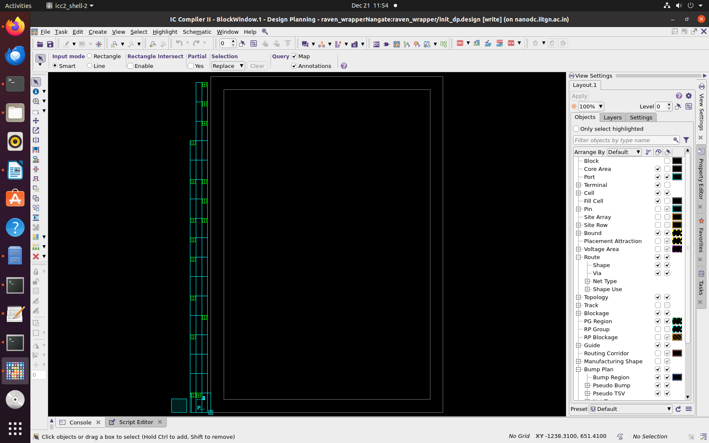
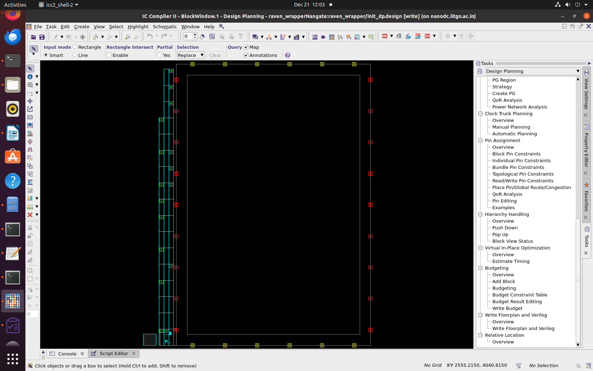
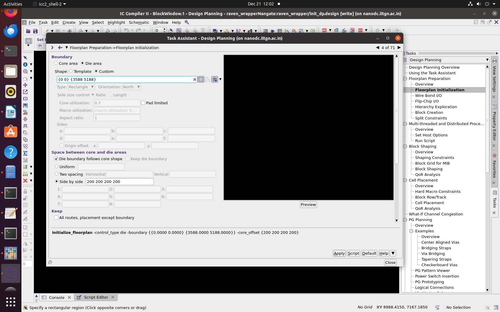

# Floorplan Task - ICC2

This document describes the floorplan creation process for the SoC design using Synopsys ICC2. The floorplan defines the die area, core area, and IO pad placement around the chip boundary.

---

## Design Specifications

| Parameter | Value |
|-----------|-------|
| **Die Size** | 3.588 mm × 5.188 mm |
| **Core Offset** | 0.2 mm (all sides) |
| **Core Area** | 3.388 mm × 4.988 mm |
| **Top-level Module** | raven_wrapper |
| **Technology** | Nangate 45nm |

---

## Floorplan Configuration

### Die and Core Boundaries

The floorplan establishes a 200 µm margin around the die perimeter to accommodate IO pads and routing channels.

- **Die Boundary:** `{0 0 3588 5188}` (µm)
- **Core Boundary:** `{200 200 3388 4988}` (µm)


---

## Implementation Flow

### 1. Environment Setup
```tcl
source ./icc2_common_setup.tcl
source ./icc2_dp_setup.tcl
```

Initializes ICC2 environment variables, library paths, and tool configurations.

### 2. Library Cleanup
```tcl
catch {close_lib -all}
if {[file exists ${WORK_DIR}/${DESIGN_LIBRARY}]} {
    file delete -force ${WORK_DIR}/${DESIGN_LIBRARY}
}
```

Removes existing NDM library to ensure a clean starting point.

### 3. NDM Library Creation
```tcl
create_lib ${WORK_DIR}/$DESIGN_LIBRARY -tech $TECH_FILE -ref_libs $REFERENCE_LIBRARY
```

Creates the design library with technology LEF and standard cell references from Nangate 45nm.

### 4. Netlist Import
```tcl
read_verilog -design ${DESIGN_NAME}/${INIT_DP_LABEL_NAME} -top ${DESIGN_NAME} ${VERILOG_NETLIST_FILES}
```

Reads the synthesized gate-level netlist into the ICC2 database.

### 5. Physical Constraints
```tcl
source $TCL_TECH_SETUP_FILE
source $TCL_PARASITIC_SETUP_FILE
```

Applies routing layer definitions, site defaults, and parasitic extraction models (TLU+).

### 6. Floorplan Initialization
```tcl
initialize_floorplan \
    -die_area {0 0 3588 5188} \
    -core_area {200 200 3388 4988}
```

Defines the physical boundaries for die and core regions. The 200 µm offset provides margin for IO placement and power ring routing.

### 7. Database Save
```tcl
save_lib -all
```

Saves the floorplan state to the NDM library.

---

## Results

### Running Floorplan 


### ICC2 GUI
```tcl
start_gui
```



### Pin Placement

IO pins were placed using automated distribution around the die perimeter:
```tcl
place_pins -self
```

Pins are evenly distributed on all four sides to optimize signal routing and minimize timing paths.



### Die Area Visualization



---

## Summary

The floorplan has been successfully created with the following characteristics:

- Die and core boundaries established
- 200 µm margin for IO and routing
- IO pins distributed around chip perimeter
- Design ready for placement phase

**Note:** This task concludes after floorplan creation. Subsequent steps (placement, CTS, routing, power distribution) are not performed at this stage.

---


