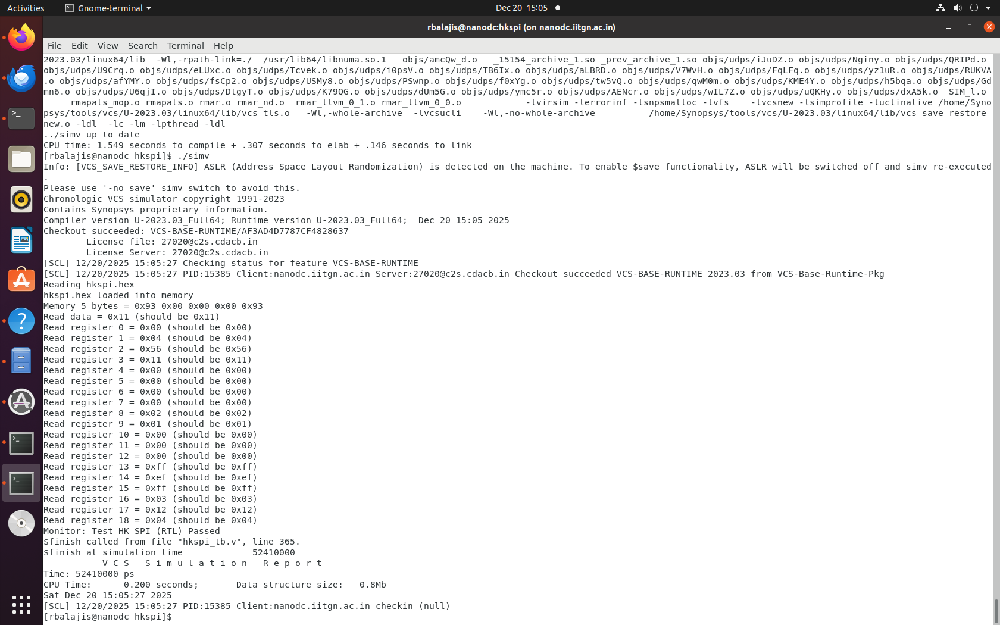
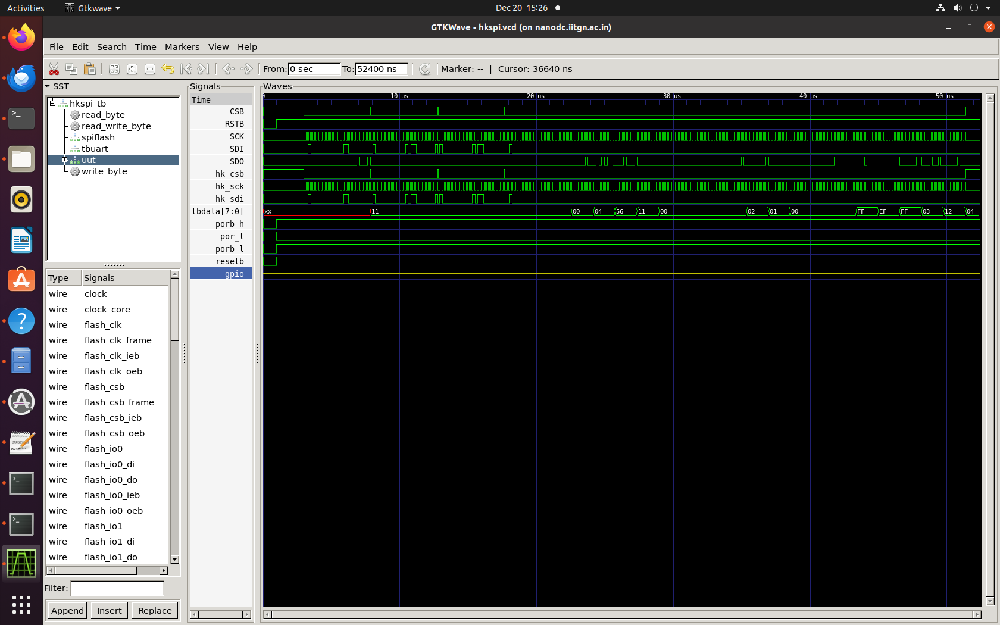
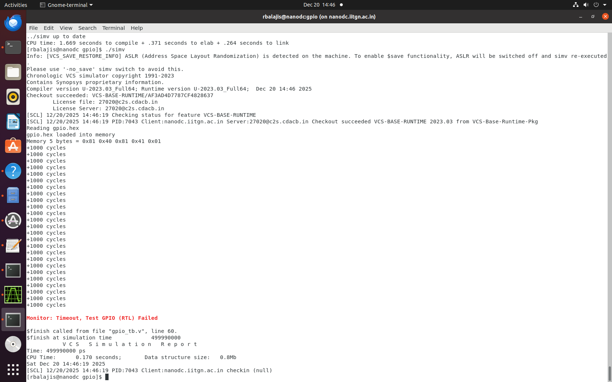
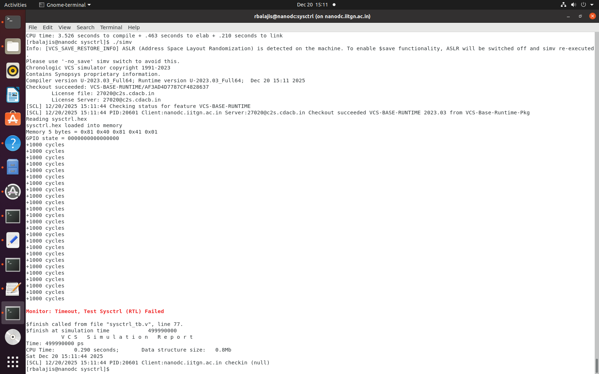
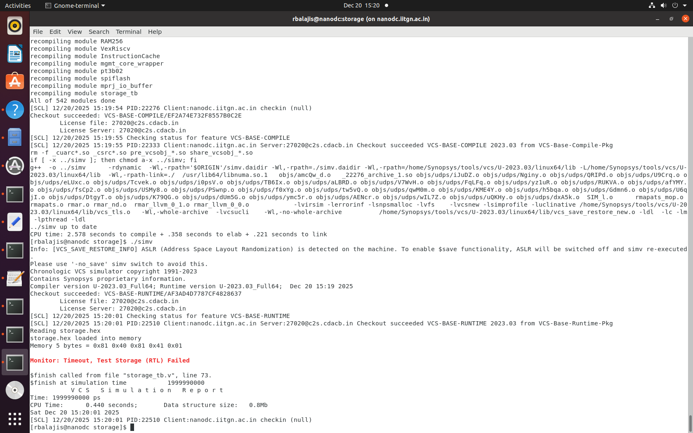
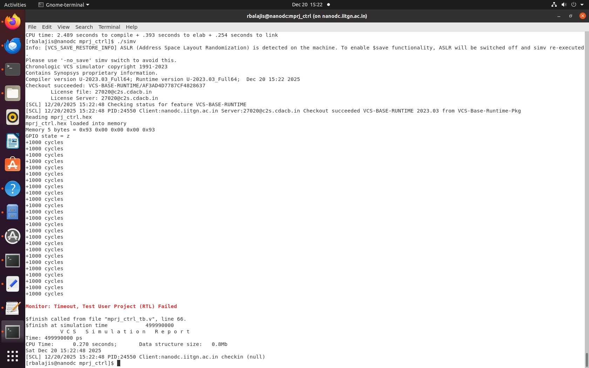

# Management SoC DV Validation on SCL-180 (POR-Free Architecture)

## Overview
This repository documents the execution of caravel SoC) DV tests on a POR-free SoC design using the SCL-180 PDK. The objective was to validate reset robustness, SRAM integration, and overall SoC behavior using the original Caravel mgmt_soc DV suite.

All tests were executed using industry-standard tools:
- Synopsys VCS (Functional + GLS)
- Synopsys DC_Shell
- SCL-180 Standard Cell and IO Libraries


#  Removal of POR Signal:


### Original POR Signal Flow

The original design utilized a `dummy_por` module that generated three critical reset signals:
```
Power Supply Ramp (vdd3v3)
    ↓
[dummy_por module]
    ↓ (internal, 500ns delay)
inode (reg)
    ↓
hystbuf1 → FIRST dummy__schmittbuf_1
    ↓
mid (wire)
    ↓
hystbuf2 → SECOND dummy__schmittbuf_1
    ↓
porb_h (output) → 3.3V domain reset (active-low)
    ↓
porb_l = porb_h → 1.8V domain reset (direct copy)
    ↓
por_l = ~porb_l → 1.8V domain reset (inverted)
    ↓
[Used by CPU, peripherals, user project]
```

### Signal Propagation Hierarchy

**dummy_por Module Output:**
```
vdd3v3
  ↓
dummy_por (porb_h, porb_l, por_l)
  ↓
caravel_core.v
  ↓
├── caravel (porb_l → porb)
├── caravel_clocking (porb_l → porb)
├── vsdcaravel.v → iopads → mprj_io
└── housekeeping (porb_l → porb)
    └── housekeeping_spi (porb + Internal Logic)
```

**External Reset Path (Testbench):**
```
Testbench (resetb)
  ↓
vsdcaravel.v (resetb)
  ↓
chip_io (resetb)
  ↓
pc3de PAD (resetb)
  ↓ (PAD delay)
chip_io (resetb_core_h)
  ↓
caravel.v (rstb_h)
  ↓
caravel_core.v (rstb_h)
  ↓
xres_buf (rstb_l)
```

### Modified Structure (After POR Module Removal)
```
Testbench
  ↓
resetb
  ↓
vsdcaravel.v
  ├── assign porb_h = resetb
  ├── assign porb_l = resetb
  └── assign por_l  = ~resetb
        ↓
caravel_core.v
  ↓
├── caravel (porb = resetb)
├── caravel_clocking (porb = resetb)
└── housekeeping (porb = resetb)
      └── housekeeping_spi (porb + internal logic)
```

## DV tests with RTL SRAM:

## hkspi test:

### Simulation Setup
    csh
    source tool_directory

    # VCS command for RTL simulation
    vcs -full64 -sverilog -timescale=1ns/1ps -debug_access+all \
    +incdir+../ +incdir+../../rtl +incdir+../../rtl/scl180_wrapper \
    +incdir+/home/Synopsys/pdk/SCL_PDK_3/SCLPDK_V3.0_KIT/scl180/iopad/cio250/6M1L/verilog/tsl18cio250/zero \
    +define+FUNCTIONAL +define+SIM \
    hkspi_tb.v -o simv

### Result:

The housekeeping SPI DV test passed successfully, demonstrating correct SPI communication, register access, and proper reset behavior of the management SoC in the POR-free design.



### Output Waveform:



The porb_l,porb_h,por_l are correctly following the resetb that is the signal given in the testbench. All the functionality of hkspi is correctly working as specification.

## GPIO Test:

This test is intended to confirm correct GPIO direction control and output behavior. The simulation did not show the expected GPIO transitions, resulting in a test failure

### Result:



## IRQ Test:

This test exercises the interrupt signaling path from generation to observation at the management level. The test failed because interrupt events were not detected during RTL execution.

### Result :


## SysCtrl Test:

This test targets system control mechanisms such as reset distribution and control signal coordination. The expected system responses were not observed, leading to a failed test outcome.
### Result:



## Storage Test:
This test evaluates internal storage access and data handling logic under RTL simulation. The test did not complete successfully due to incorrect or missing storage behavior.

### Result:



## mprj_ctrl Test:

This test verifies control interactions between the management core and the user project. The control interface did not respond as expected, causing the test to fail.

### Result:




## Summary

| Test Name   | Result |
|------------|--------|
| HKSPI      | Passed |
| GPIO       | Failed |
| IRQ        | Failed |
| SysCtrl    | Failed |
| Storage    | Failed |
| mprj_ctrl  | Failed |


