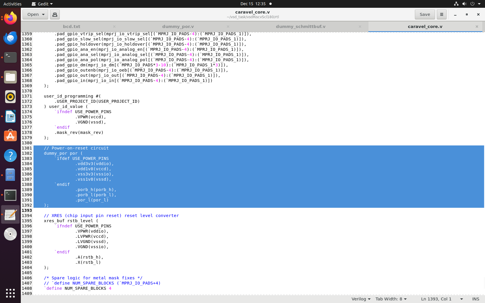
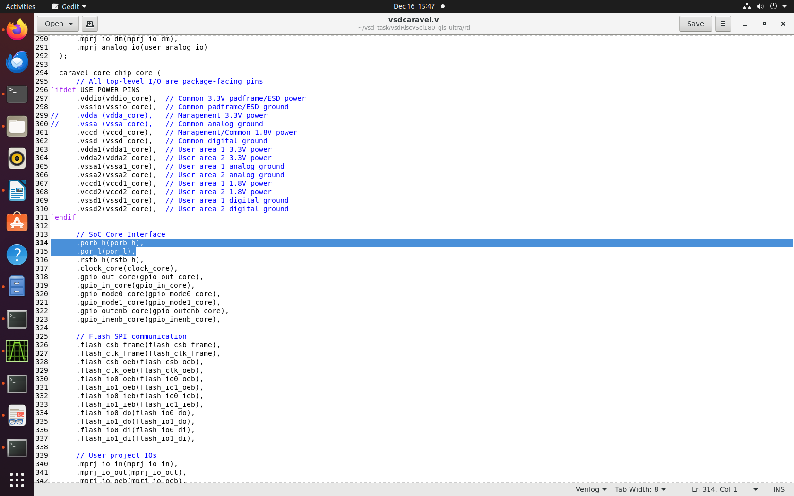
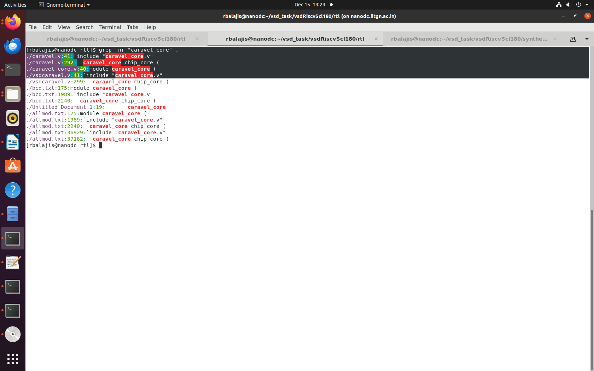
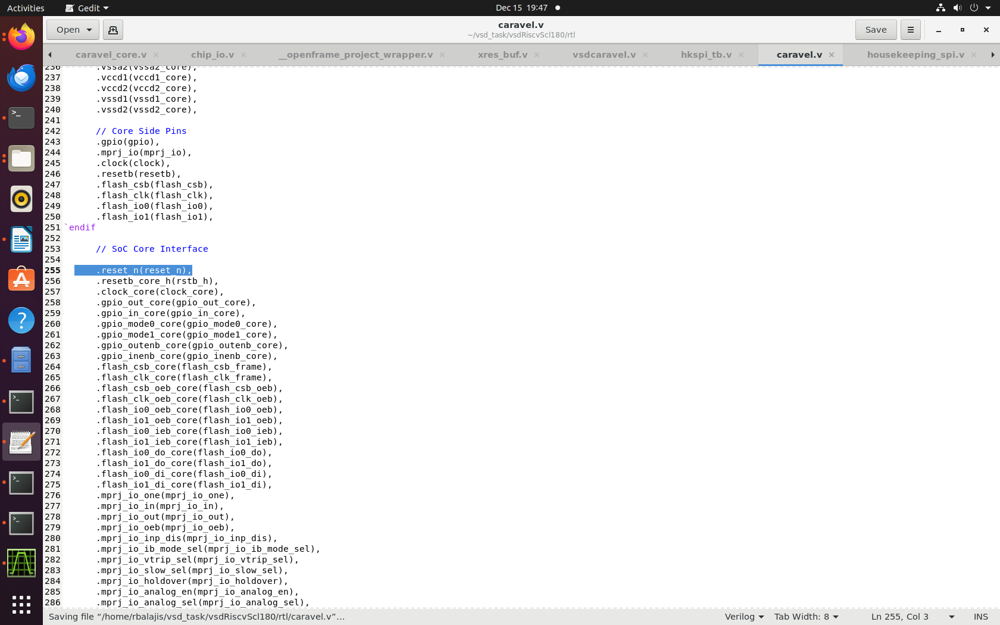
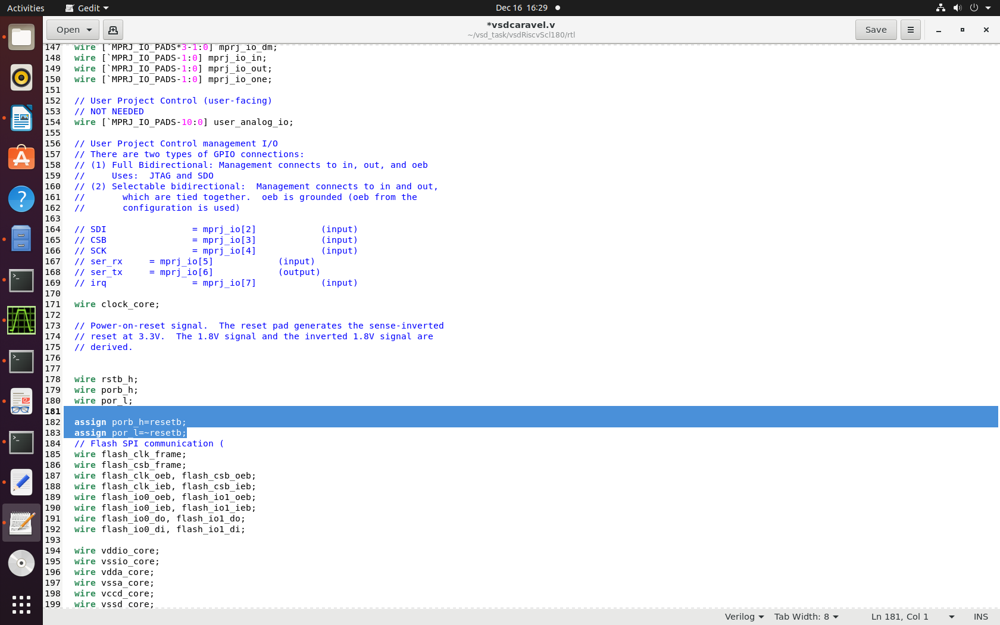
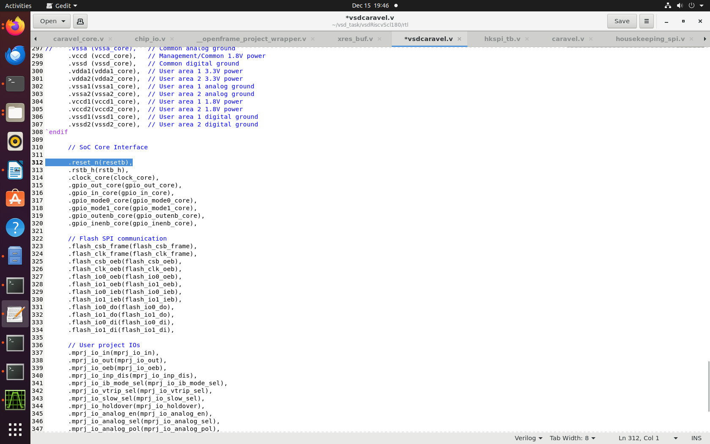

### Signal Flow of dummy_por:

    +-----------------+
    |    vdd3v3      |
    +-----------------+
            |
            v
    +-----------------+
    |   dummy_por    |
    | porb_h,porb_l, |
    |     por_l      |
    +-----------------+
            |
            v
    +-----------------+
    | caravel_core.v |
    | porb_h,porb_l, |
    |     por_l      |
    +-----------------+
        |          |
        v          v
    +-----------+ +-----------------+
    |caravel_   | |  housekeeping   |
    |clocking   | |   (porb_l→porb) |
    |porb_l→porb| +-----------------+
    +-----------+         |
                        v
                +-----------------+
                |housekeeping_spit|
                | porb + Internal |
                |   Logic         | 
                +-----------------+

### Signal flow of resetb from TestBench:

    +-----------------+
    |      tb        |
    |    resetb      |
    +-----------------+
            |
            v
    +-----------------+
    |  vsdcaravel    |
    |    resetb      |
    +-----------------+
            |
            v
    +-----------------+
    |   chip_io      |
    |    resetb      |
    +-----------------+
            |
            v
    +-----------------+
    |   pc3de PAD    |
    |    resetb      |
    +-----------------+
            |
            v (PAD delay)
    +-----------------+
    |   chip_io      |
    | resetb_core_h  |
    +-----------------+
            |
            v
    +-----------------+
    |  caravel.v     |
    |    rstb_h      |
    +-----------------+
            |
            v
    +-----------------+
    |caravel_core.v  |
    |    rstb_h      |
    +-----------------+
            |
            v
    +-----------------+
    |  xres_bef      |
    |    rstb_l      |
    +-----------------+
            |
            v
        (continues...)

### Removal of dummy_por :

The three signals porb_h,porb_l,por_l come from dummy_por to  caravel_core.v. From that it goes to the other modules as porh_l signal no other propogates from this module out of the three signal.

-  Deletion of Dummy_por module

- After deletion In cravel_core.v the three signals is assigned as output but there is no source for that signal so we need to give the external reset from the testbench.

- the signal from testbench given to vsdcaravel.v so we need to propogate the external signal to the caravel_core.v through the vsdcaravel.The vsdcaravel has alread a instantiation to caravel_core as it get the porb_h and por_l from vsdcaravel.The porh_l is used in caravel_core so i remove the other two signal and only porh_l is modified as inout port and named as reset_n for reference .

- now caravel_core signal is reduced so we need to change the signals initialization in all of instatiated module 

 - from this it is clear that caravel.v and vsdcaravel.v so we need to modify instantiation

- then in vsdcaravel assigning the signals to resetb from testbench 

- assigning the reset_n of caravel_core to resetb of testbench this is actual connection between the testbench and caravel_core. From there it goes to every module which replace the signal of the dummy_por.

