# RTL Simulation, Synthesis, and GLS of Caravel SoC using SCL-180 (POR Removed)

## Table of Contents
- [Overview](#overview)
- [Architecture](#architecture)
- [POR Removal Implementation](#por-removal-implementation)
- [RTL Simulation](#rtl-simulation)
- [Synthesis](#synthesis)
- [Gate Level Simulation](#gate-level-simulation)
- [Reset Functionality Verification](#reset-functionality-verification)

## Overview

This documentation describes the complete RTL-to-GLS flow for the Caravel SoC implementation using SCL-180nm technology. The primary modification involves removing the internal Power-On-Reset (POR) module and replacing it with an external reset mechanism controlled from the testbench.

## Architecture

### Original POR Signal Flow

The original design utilized a `dummy_por` module that generated three critical reset signals through the following chain:

```
Power Supply Ramp (vdd3v3)
    ↓
[dummy_por module]
    ↓ (internal, 500ns delay)
inode (reg)
    ↓
hystbuf1 → FIRST dummy__schmittbuf_1
    ↓
mid (wire)
    ↓
hystbuf2 → SECOND dummy__schmittbuf_1
    ↓
porb_h (output) → 3.3V domain reset (active-low)
    ↓
porb_l = porb_h → 1.8V domain reset (direct copy)
    ↓
por_l = ~porb_l → 1.8V domain reset (inverted)
    ↓
[Used by CPU, peripherals, user project]
```

### Signal Propagation Hierarchy

**dummy_por Module Output:**
```
vdd3v3
  ↓
dummy_por (porb_h, porb_l, por_l)
  ↓
caravel_core.v
  ↓
├── caravel (porb_l → porb)
├── caravel_clocking (porb_l → porb)
├── vsdcaravel.v → iopads → mprj_io(not used there)
├── housekeeping (porb_l → porb)
    ↓
    housekeeping_spi (porb + Internal Logic)

vsdcaravel.v
```

**External Reset Path (Testbench):**
```
Testbench (resetb)
  ↓
vsdcaravel.v (resetb)
  ↓
chip_io (resetb)
  ↓
pc3de PAD (resetb)
  ↓ (PAD delay)
chip_io (resetb_core_h)
  ↓
caravel.v (rstb_h)
  ↓
caravel_core.v (rstb_h)
  ↓
xres_buf (rstb_l)

```

## POR Removal Implementation

### Step 1: Delete dummy_por Module

The `dummy_por` module was removed from the design hierarchy. This module previously generated three reset signals: `porb_h`, `porb_l`, and `por_l`.


### Step 2: Modify caravel_core.v

After removing the `dummy_por` module, the three signals in `caravel_core.v` became undriven outputs requiring an external source. Analysis revealed that only `porb_l` propagates to downstream modules, making the other two signals redundant.


### Step 3: Signal Consolidation

Modified `caravel_core.v` to:
- Remove unused signals `porb_h` and `por_l`
- Reconfigure `porb_l` as an inout port
- Rename to `reset_n` for clarity

### Step 4: Update Module Instantiations

Updated all module instantiations that reference `caravel_core` to reflect the reduced signal count:


The primary modifications were required in:
- `caravel.v`
- `vsdcaravel.v`


### Step 5: Connect External Reset

Connected the testbench `resetb` signal to `vsdcaravel.v`:


Established the connection between testbench and `caravel_core` through vsdcaravel

vsdcaravel as the three signals porh_b,por_l,porh_l which is assigned to the resetb from testbench and resetb is passes to the carave_core as reset_n.


This creates the complete reset path from testbench to all internal modules, effectively replacing the `dummy_por` functionality.

## RTL Simulation

### Simulation Setup

```bash
csh
source tool_directory

# VCS command for RTL simulation
vcs -full64 -sverilog -timescale=1ns/1ps -debug_access+all \
+incdir+../ +incdir+../../rtl +incdir+../../rtl/scl180_wrapper \
+incdir+/home/Synopsys/pdk/SCL_PDK_3/SCLPDK_V3.0_KIT/scl180/iopad/cio250/6M1L/verilog/tsl18cio250/zero \
+define+FUNCTIONAL +define+SIM \
hkspi_tb.v -o simv
```

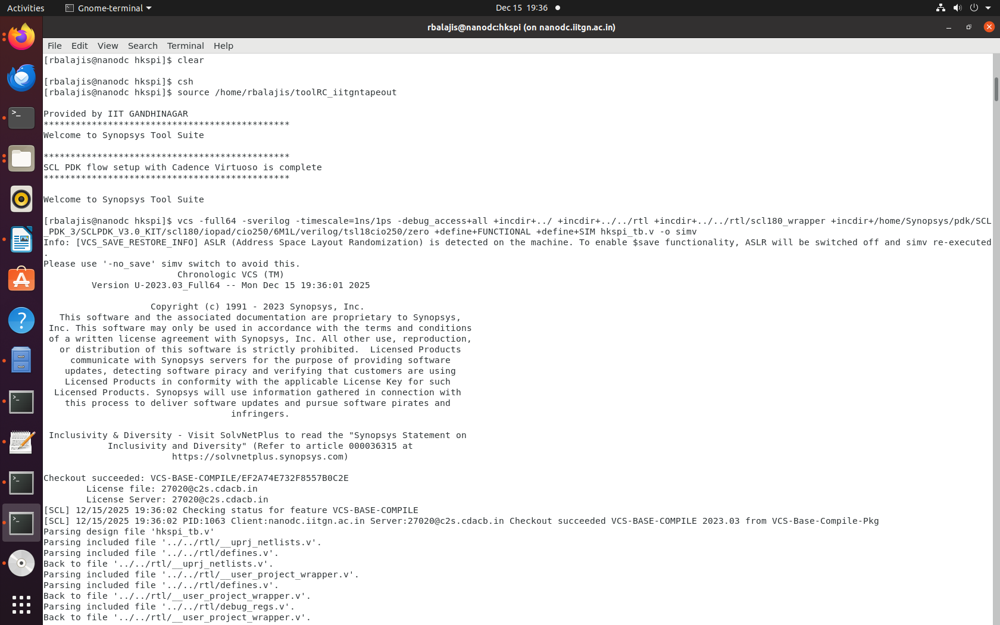

### Execute Simulation

```bash
./simv
```

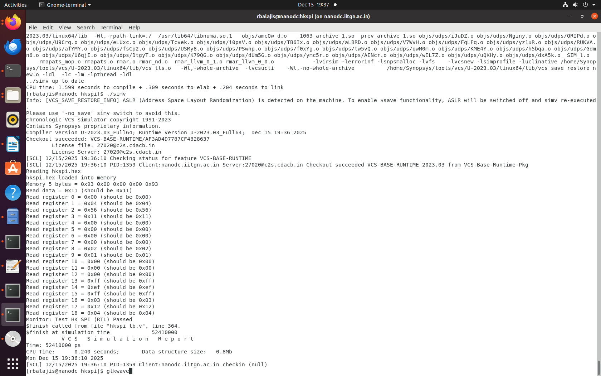

### Waveform Analysis

View the simulation waveforms using GTKWave:

```bash
gtkwave hksim.vcd
```

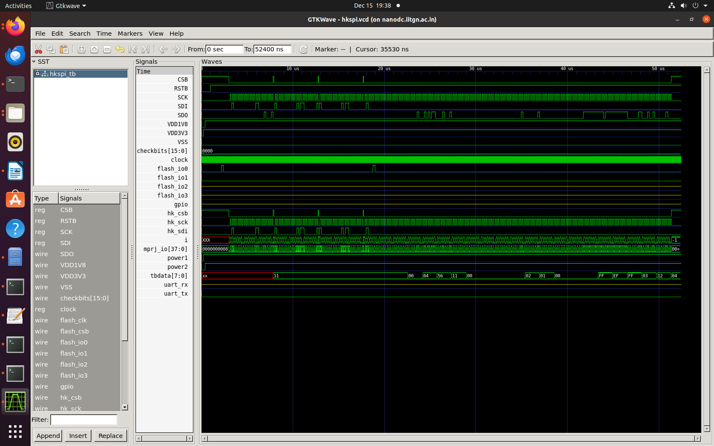

## Synthesis

### Synthesis Script Execution

```bash
csh
source /home/rbalajis/toolRC_iitgntapeout
dc_shell -f ../synth.tcl
```

### Synthesized Netlist

The synthesized netlist confirms successful removal of the `dummy_por` module:

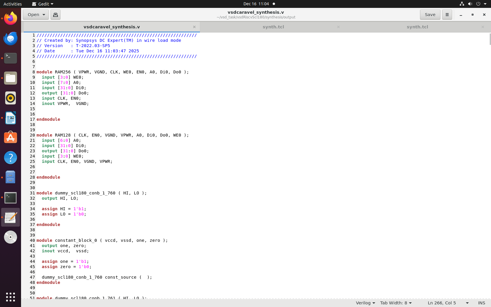
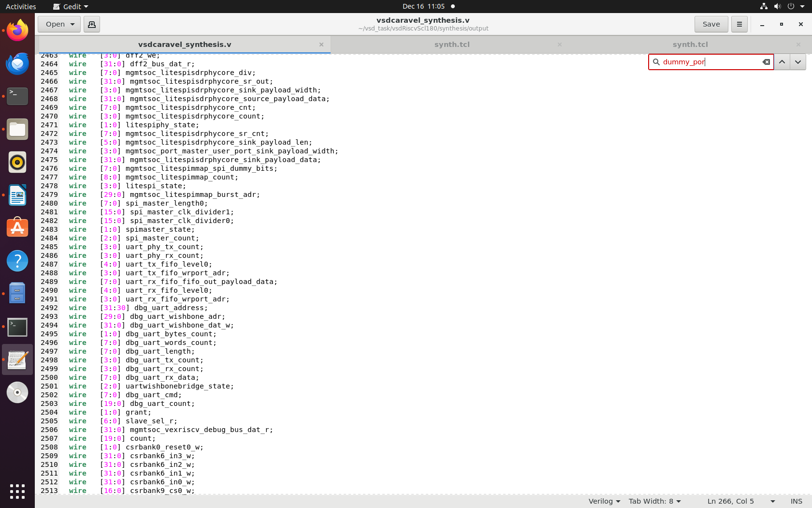

**Note:** The absence of `dummy_por` in the netlist validates the architectural modification.

## Gate Level Simulation

### Preparation

For functional verification at the gate level, the blackbox modules `RAM128` and `RAM256` were replaced with their Verilog behavioral models:

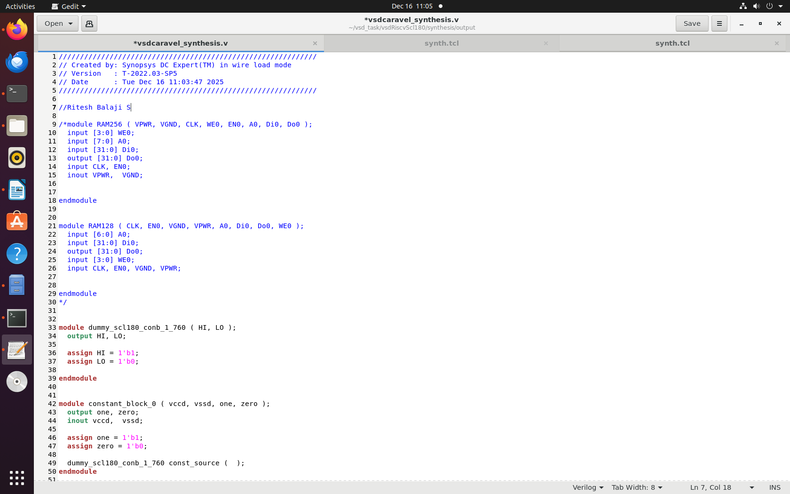
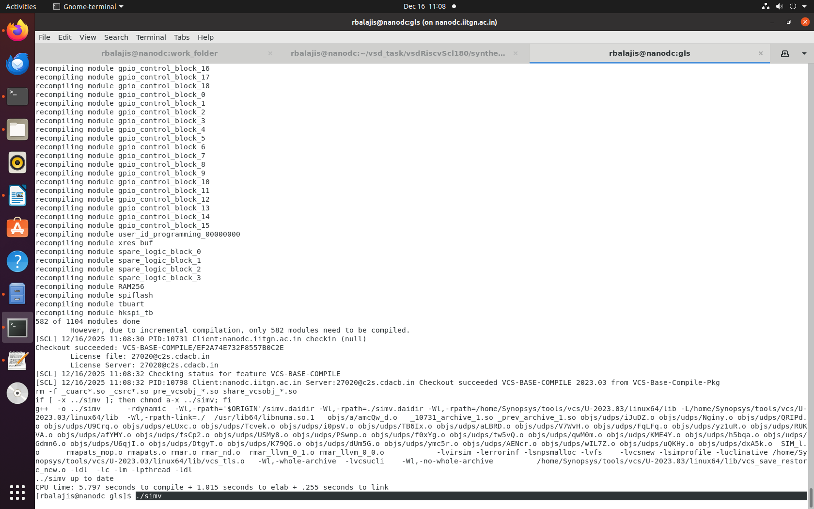

### Execute GLS

```bash
./simv
```

### Simulation Results

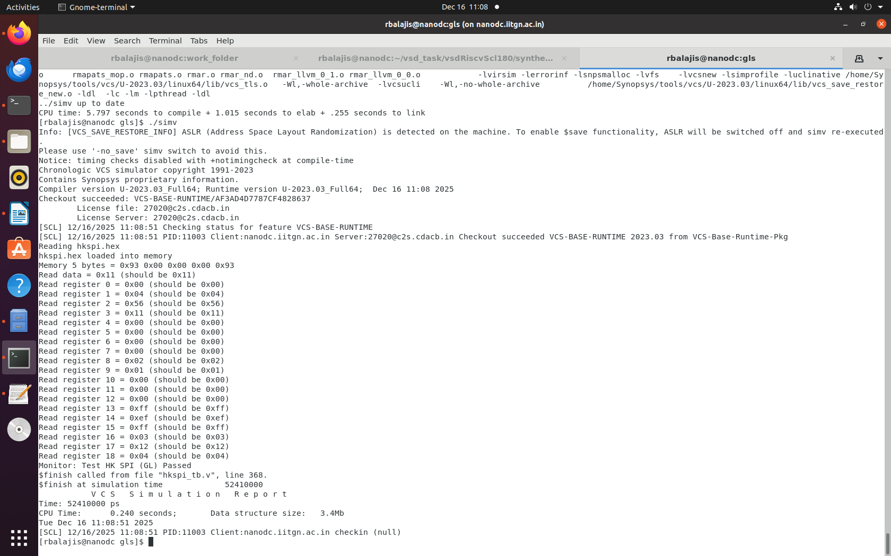

### Waveform Verification

The waveforms demonstrate proper reset behavior and functional correctness:

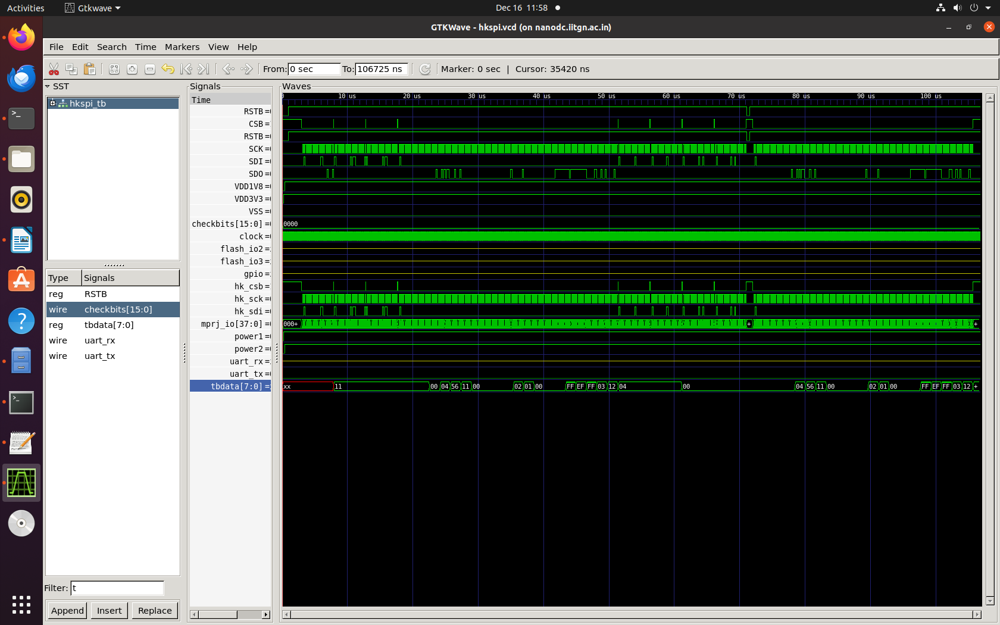
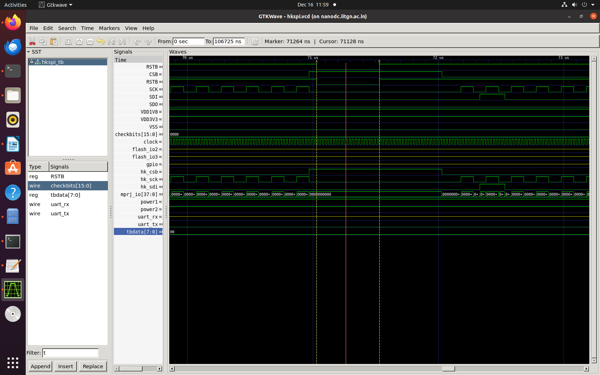

The highlighted region shows the point where reset is re-triggered to verify reset functionality.

## Reset Functionality Verification

### Test Methodology

To validate the external reset mechanism, the following test sequence was implemented in the testbench:

```verilog
// Write 0x00 to registers 0x08 and 0x09 (override default values)
$display("Writing the value 0x00 to register 0x08 and 0x09");

start_csb();
write_byte(8'h80);  // Write stream command
write_byte(8'h08);  // Address (register 8 default value = 0x02)
write_byte(8'h00);  // Data = 0x00 giving external value
end_csb();

start_csb();
write_byte(8'h40);  // Read stream command
write_byte(8'h08);  
read_byte(tbdata);
end_csb();
#10;
$display("Read data = 0x%08x (should be 0x00)", tbdata);

start_csb();
write_byte(8'h80);  // Write stream command
write_byte(8'h09);  // Address (register 9 default value = 0x01)
write_byte(8'h00);  // Data = 0x00 giving external value
end_csb();

start_csb();
write_byte(8'h40);  // Read stream command
write_byte(8'h09);  
read_byte(tbdata);
end_csb();
#10;
$display("Read data = 0x%09x (should be 0x00)", tbdata);

// Apply reset
RSTB <= 1'b0;
#500;
RSTB <= 1'b1;
#500;

$display("Reset is applied now the values of 0x08 and 0x09 should return to default values");
$display("Register 8 default value = 0x02, Register 9 default value = 0x01");
```

### Test Sequence

1. Write `0x00` to registers `0x08` and `0x09` (modifying from default values `0x02` and `0x01`)
2. Read back to confirm values are `0x00`
3. Assert reset (`RSTB = 0`)
4. Deassert reset after 500ns
5. Verify registers return to default values (`0x02` and `0x01`)

### Results

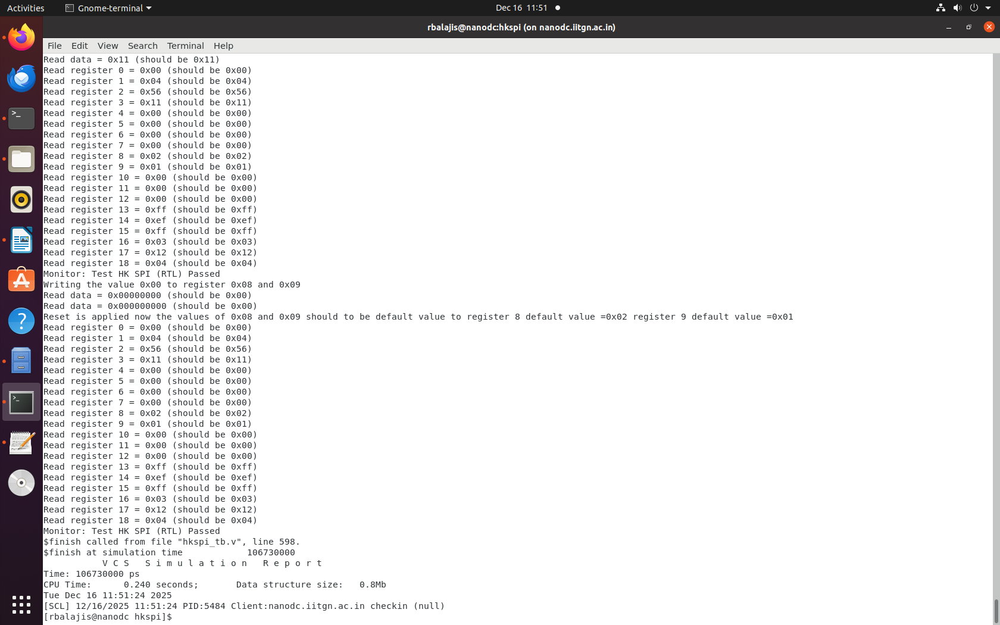

The simulation output confirms successful reset operation with registers returning to their default values.


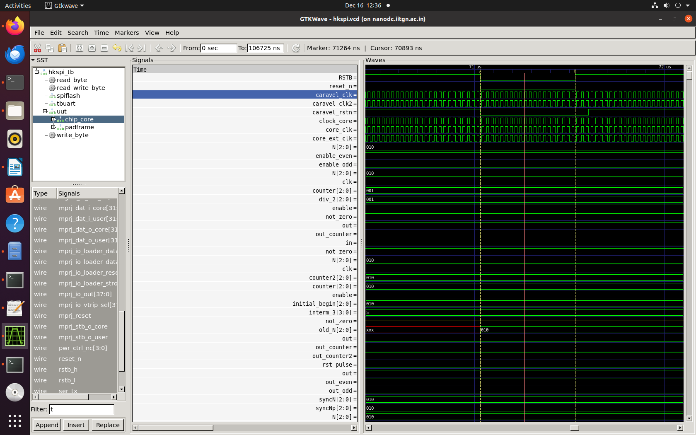

The waveforms demonstrate proper reset assertion and restoration of default register values.

## Conclusion

This implementation successfully demonstrates:
- Removal of internal POR circuitry
- Integration of external reset control
- Complete RTL-to-GLS verification flow
- Functional correctness of the reset mechanism

The modified Caravel SoC design maintains full functionality while providing direct reset control from the testbench environment.
