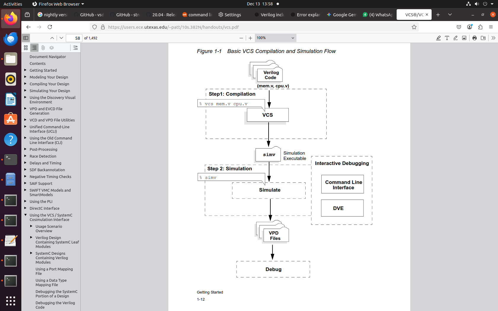
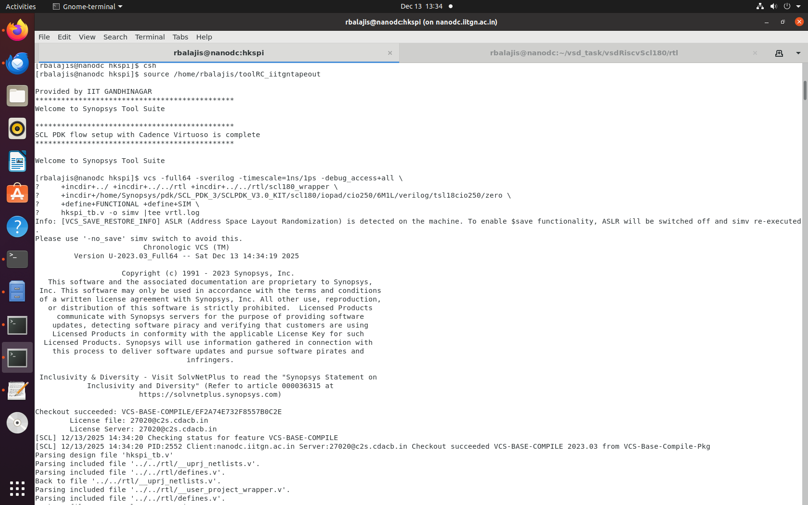
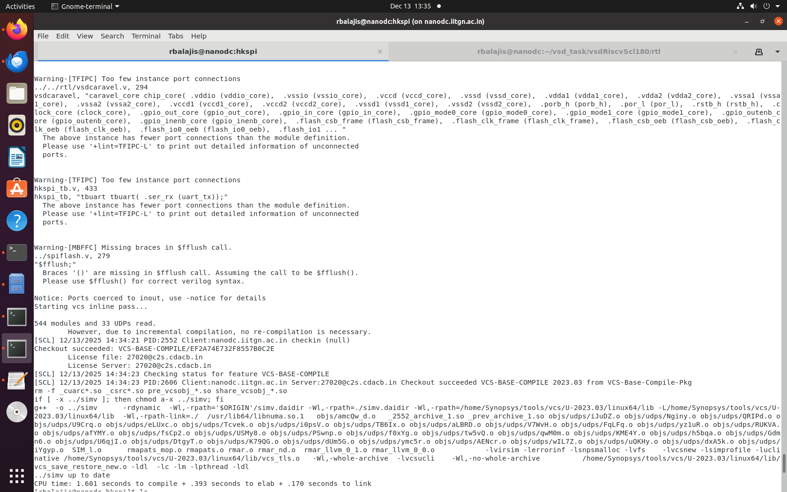
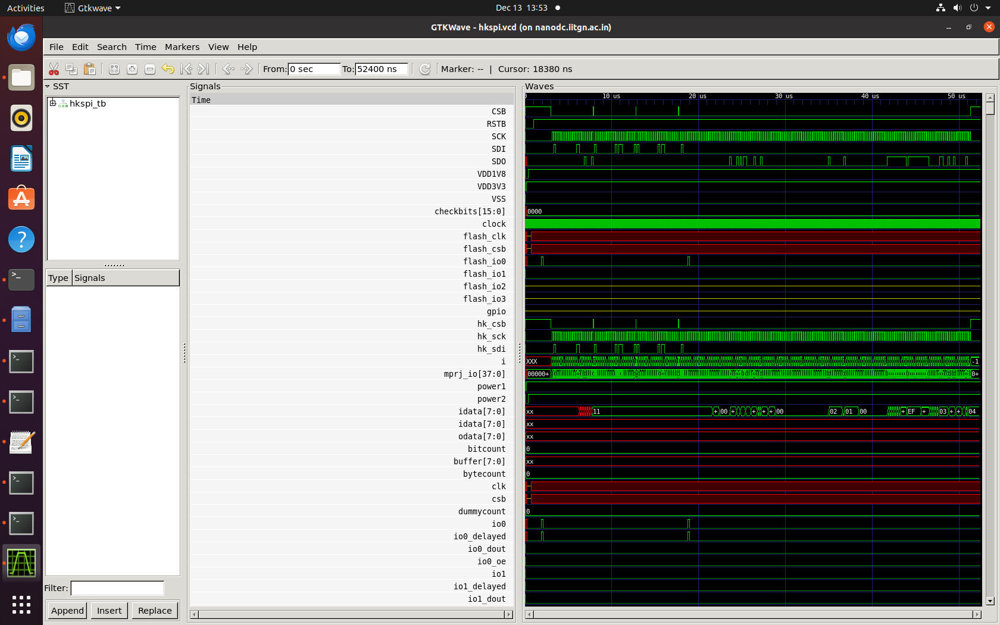
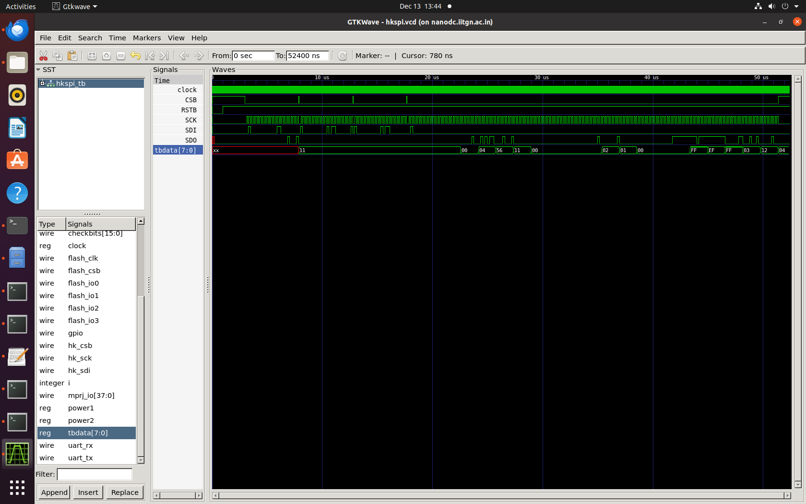
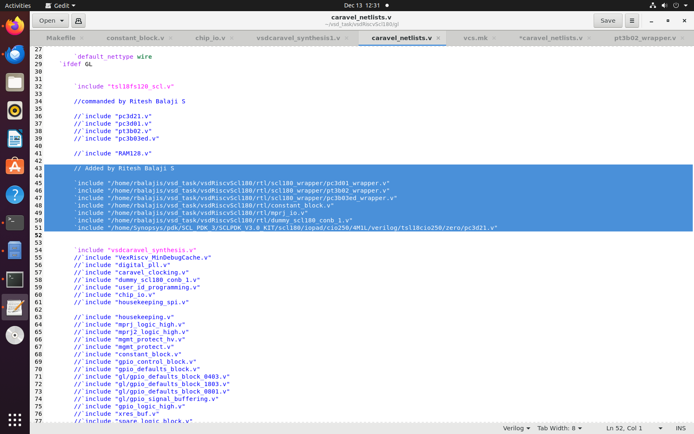
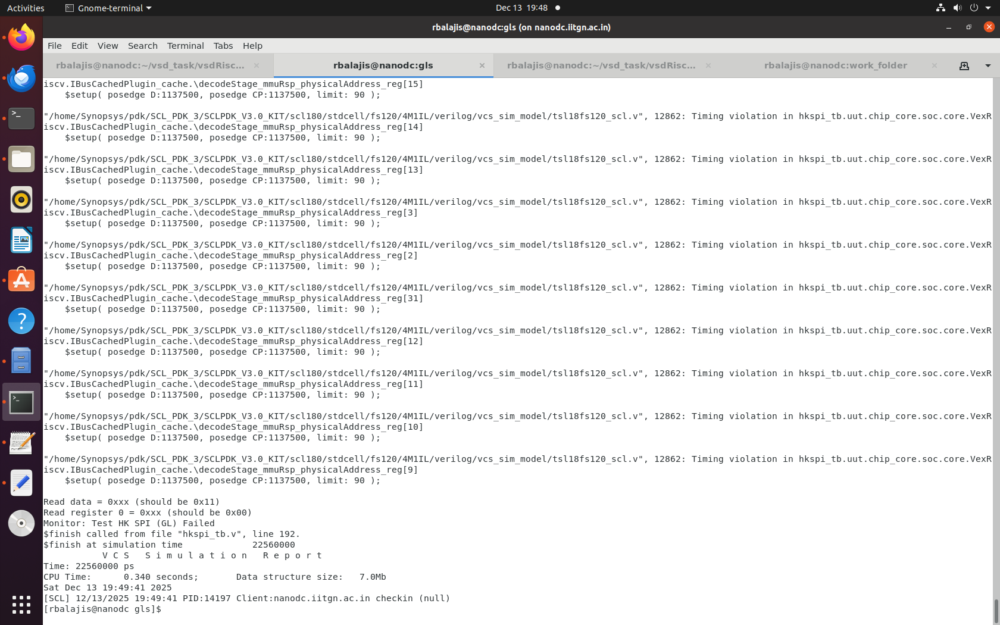
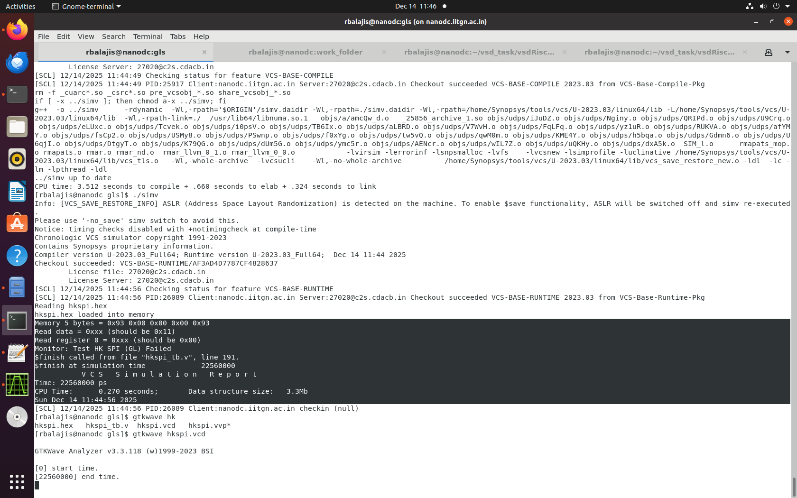
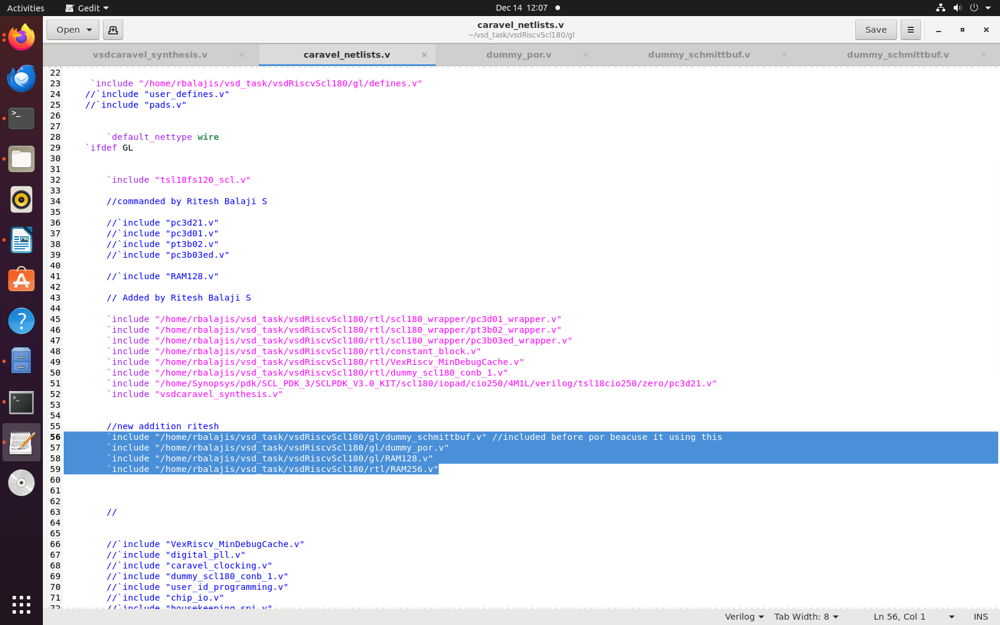
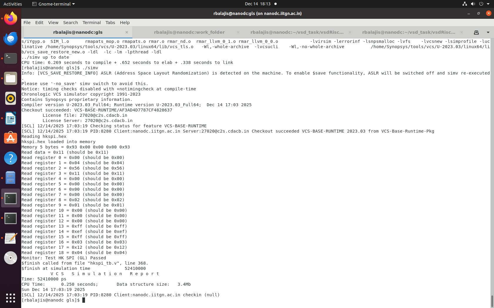

# RTL vs GLS Simulation using Synopsys(dc_shell -topo)

## RTL Simulation :

### Simulation using VCS

First, the Verilog files are compiled using VCS to create a simulation executable (simv).
Next, simv is run to simulate the design and generate waveform (VPD) files.
Finally, the results are analyzed and debugged.

    csh
    source tool_directory 

    //vcs command to run rtl synthesis 

    
    vcs -full64 -sverilog -timescale=1ns/1ps -debug_access+all \
    +incdir+../ +incdir+../../rtl +incdir+../../rtl/scl180_wrapper \
    +incdir+/home/Synopsys/pdk/SCL_PDK_3/SCLPDK_V3.0_KIT/scl180/iopad/cio250/6M1L/verilog/tsl18cio250/zero \
    +define+FUNCTIONAL +define+SIM \
    hkspi_tb.v -o simv
        

### Running Test

    ./simv //name of op 

### WaveForm(Using GTKWave):

    ./simv -no_save +define+DUMP_VCD=1 | tee sim_log.txt

---

## GLS:

### Black Boxing :
Black boxing in synthesis is used when certain modules are not ready or intentionally hidden from the design flow.Instead of synthesizing their internal logic, these modules are treated as placeholders with only their input and output interfaces defined.

This allows the rest of the design to be synthesized and verified without being blocked by missing or proprietary blocks.Later, the actual implementations can be integrated without changing the top-level design.

In this synthesis we are going to black box some modules like RAM128,RAM256, digital_por.

### Synthesis using dc topo :

*synth.tcl* :

    # ------------------------------------------------------------
    # Load technology libraries
    # ------------------------------------------------------------
    read_db "/home/Synopsys/pdk/SCL_PDK_3/SCLPDK_V3.0_KIT/scl180/iopad/cio250/4M1L/liberty/tsl18cio250_min.db"
    read_db "/home/Synopsys/pdk/SCL_PDK_3/SCLPDK_V3.0_KIT/scl180/stdcell/fs120/4M1IL/liberty/lib_flow_ff/tsl18fs120_scl_ff.db"
    
    set target_library "/home/Synopsys/pdk/SCL_PDK_3/SCLPDK_V3.0_KIT/scl180/iopad/cio250/4M1L/liberty/tsl18cio250_min.db \
                        /home/Synopsys/pdk/SCL_PDK_3/SCLPDK_V3.0_KIT/scl180/stdcell/fs120/4M1IL/liberty/lib_flow_ff/tsl18fs120_scl_ff.db"
    
    set link_library "* $target_library"
    
    # ------------------------------------------------------------
    # Paths and top module
    # ------------------------------------------------------------
    set root_dir "/home/rbalajis/vsd_task/vsdRiscvScl180"
    set rtl_dir  "$root_dir/rtl"
    set top_module "vsdcaravel"
    
    set out_dir "$root_dir/synthesis/output"
    set rpt_dir "$root_dir/synthesis/report"
    
    # ------------------------------------------------------------
    # Create blackbox stubs (RAM + POR) or we can create a manual stub file and attach the directory here
    # ------------------------------------------------------------
    set bb_file "$root_dir/synthesis/ram_por_blackbox_stubs.v"
    set fp [open $bb_file w]
    
    puts $fp "(* blackbox *) module RAM128(CLK, EN0, VGND, VPWR, A0, Di0, Do0, WE0);"
    puts $fp "input CLK, EN0, VGND, VPWR;"
    puts $fp "input [6:0] A0; input [31:0] Di0; input [3:0] WE0; output [31:0] Do0;"
    puts $fp "endmodule"
    
    puts $fp "(* blackbox *) module RAM256(VPWR, VGND, CLK, WE0, EN0, A0, Di0, Do0);"
    puts $fp "inout VPWR, VGND; input CLK, EN0;"
    puts $fp "input [7:0] A0; input [31:0] Di0; input [3:0] WE0; output [31:0] Do0;"
    puts $fp "endmodule"
    
    puts $fp "(* blackbox *) module dummy_por(vdd3v3, vdd1v8, vss3v3, vss1v8, porb_h, porb_l, por_l);"
    puts $fp "inout vdd3v3, vdd1v8, vss3v3, vss1v8;"
    puts $fp "output porb_h, porb_l, por_l;"
    puts $fp "endmodule"
    
    close $fp
    
    # ------------------------------------------------------------
    # Reading RTL
    # ------------------------------------------------------------
    read_file $rtl_dir/defines.v -format verilog
    read_file $bb_file -format verilog
    
    set rtl_files [glob -nocomplain $rtl_dir/*.v]
    
    #omiting this rtl files from readed entire rtl file 
    
    set rtl_files [lremove $rtl_files \
        "$rtl_dir/RAM128.v" \
        "$rtl_dir/RAM256.v" \
        "$rtl_dir/dummy_por.v" ]
    
    read_file $rtl_files -define USE_POWER_PINS -format verilog
    
    # ------------------------------------------------------------
    # Elaborate & Link
    # ------------------------------------------------------------
    elaborate $top_module
    link
    uniquify
    
    # ------------------------------------------------------------
    # Marking blackboxes and dont_touch
    # ------------------------------------------------------------
    foreach blk {RAM128 RAM256 dummy_por} {
        if {[sizeof_collection [get_designs -quiet $blk]] > 0} {
            set_attribute [get_designs $blk] is_black_box true
            set_dont_touch [get_designs $blk]
        }
    }
    
    # ------------------------------------------------------------
    # Compile  topo
    # ------------------------------------------------------------
    compile_ultra -topographical -effort high   
    compile -incremental -map_effort high
    # ------------------------------------------------------------
    # Write outputs
    # ------------------------------------------------------------
    write -format verilog -hierarchy -output "$out_dir/vsdcaravel_synthesis.v"
    write -format ddc     -hierarchy -output "$out_dir/vsdcaravel_synthesis.ddc"
    write_sdc "$out_dir/vsdcaravel_synthesis.sdc"
    
    # ------------------------------------------------------------
    # Reports
    # ------------------------------------------------------------
    report_area       > "$rpt_dir/area.rpt"
    report_power      > "$rpt_dir/power.rpt"
    report_timing     > "$rpt_dir/timing.rpt"
    report_qor        > "$rpt_dir/qor.rpt"
    report_constraint -all_violators > "$rpt_dir/constraints.rpt"
    
    # ------------------------------------------------------------
    # End
    # ------------------------------------------------------------

After running the synthesised file will be saved in synthesis/output/vsdcaravel_synthesis.v which contains the synthesised modules of every rtl files except some of the files like blackboxed file will just contain the input and output port declaration .

---

### Simulation:

    vcs -full64 -sverilog -timescale=1ns/1ps \
    -debug_access+all \
    +define+FUNCTIONAL+SIM+GL \
    +notimingchecks \
    hkspi_tb.v \
    +incdir+../synthesis/output \
    +incdir+/home/Synopsys/pdk/SCL_PDK_3/SCLPDK_V3.0_KIT/scl180/iopad/cio250/4M1L/verilog/tsl18cio250/zero \
    +incdir+/home/Synopsys/pdk/SCL_PDK_3/SCLPDK_V3.0_KIT/scl180/stdcell/fs120/4M1IL/verilog/vcs_sim_model \
    -o simv

This commands reads only the output synthesis file ,testbench and scl directories. Because all the modules are generated as netlist in that vsdcaravel_synthesis.v intslef if we try to read rtl files it will through the **double declaration of module error** in simulation.

### Errors and Debugging

There will be some file is **no included -ERROR*  because some of the modules is just instantiated in netlist so we need to include that files. Our command doesnt read rtl files in rtl folder So, we are including all the neccessary files in caravel_netlist .

**ERROR - unmatches width of variable named wbs_adr_i** the error occurs because the same variable is declared as input and also tri but in tri only [1:0] 1 bit size is redeclared but the actual size in input is [31:0] so correct it and run the simulation.Also there will more error in include files include it properly and not include the duplicate modules.

### Report:

    ./simv
    

- the gls test failed because of the blackboxed modules as it functionality is completely removed from the block so signals of 0xXX values .

### Waveform:

## GLS (included functionality of Black Boxed Module):

In vsdcaravel_synthesis.v command out the blackboxed module to just check whether the other netlist functionality works correctly. Include the directory of the these three file RAM128.v,RAM256.v , digital_por.v in caravel_netlist.v(which contains include files) which is in gl.

### Simulation :

     vcs -full64 -sverilog -timescale=1ns/1ps \
    -debug_access+all \
    +define+FUNCTIONAL+SIM+GL \
    +notimingchecks \
    hkspi_tb.v \
    +incdir+../synthesis/output \
    +incdir+/home/Synopsys/pdk/SCL_PDK_3/SCLPDK_V3.0_KIT/scl180/iopad/cio250/4M1L/verilog/tsl18cio250/zero \
    +incdir+/home/Synopsys/pdk/SCL_PDK_3/SCLPDK_V3.0_KIT/scl180/stdcell/fs120/4M1IL/verilog/vcs_sim_model \
    -o simv

### Waveform (gtkwave):

