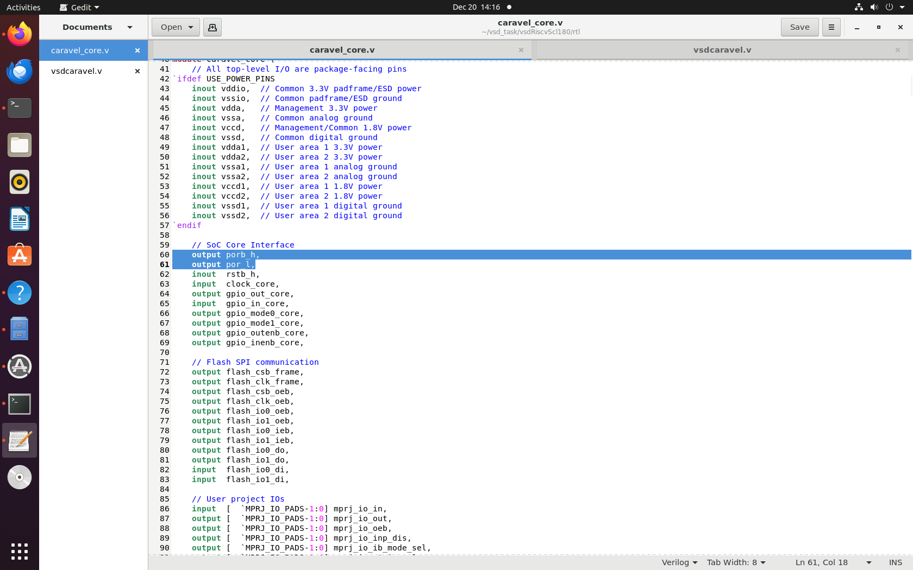
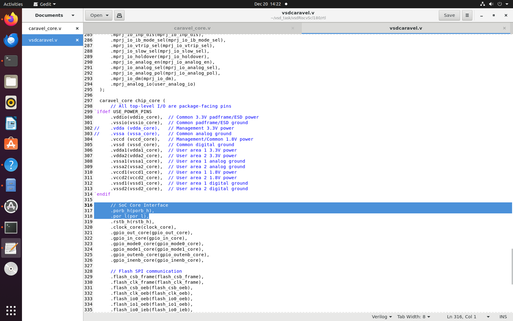
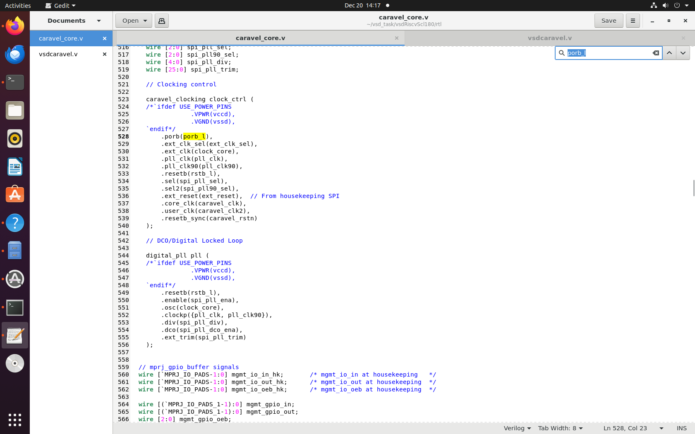
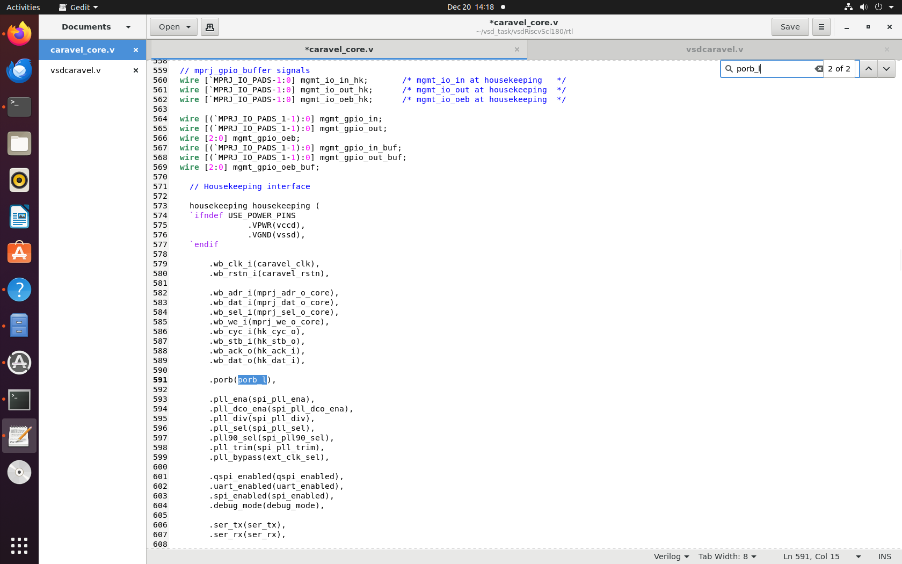
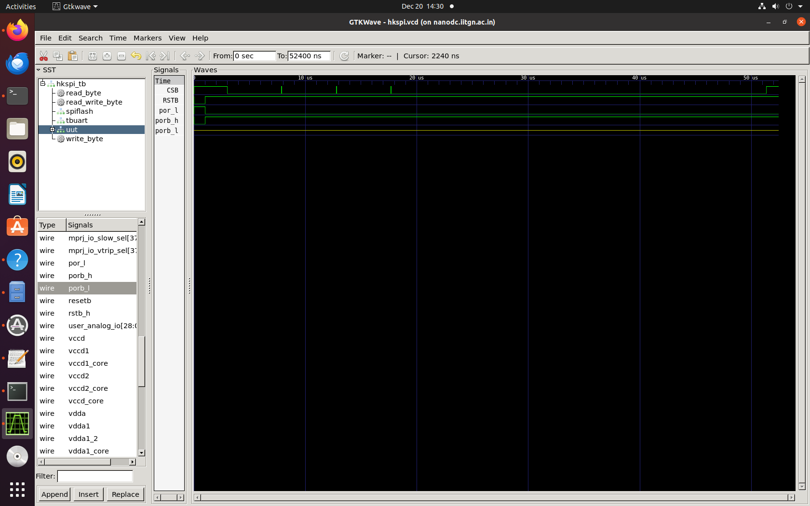
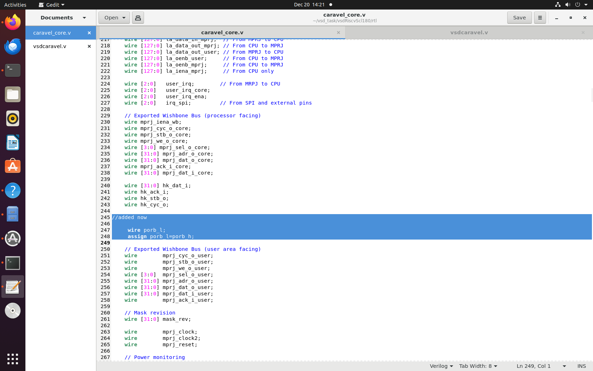
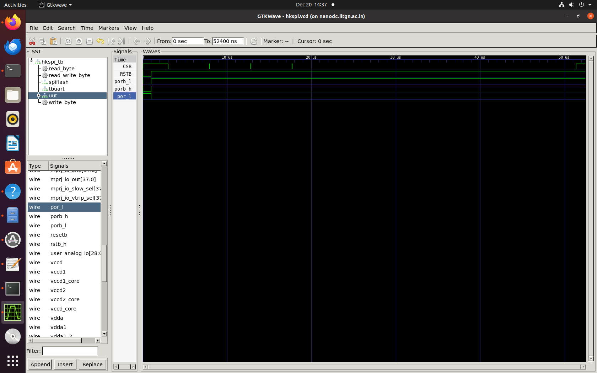

# POR Signal Declaration Issue in caravel_core.v

## Problem Statement

The signal `porb_l` is not declared in `caravel_core.v`, causing it to enter a high-impedance state during RTL simulation and resulting in test failures.

## Architecture

### Original POR Signal Flow

The original design utilized a `dummy_por` module that generated three critical reset signals:
```
Power Supply Ramp (vdd3v3)
    ↓
[dummy_por module]
    ↓ (internal, 500ns delay)
inode (reg)
    ↓
hystbuf1 → FIRST dummy__schmittbuf_1
    ↓
mid (wire)
    ↓
hystbuf2 → SECOND dummy__schmittbuf_1
    ↓
porb_h (output) → 3.3V domain reset (active-low)
    ↓
porb_l = porb_h → 1.8V domain reset (direct copy)
    ↓
por_l = ~porb_l → 1.8V domain reset (inverted)
    ↓
[Used by CPU, peripherals, user project]
```

### Signal Propagation Hierarchy

**dummy_por Module Output:**
```
vdd3v3
  ↓
dummy_por (porb_h, porb_l, por_l)
  ↓
caravel_core.v
  ↓
├── caravel (porb_l → porb)
├── caravel_clocking (porb_l → porb)
├── vsdcaravel.v → iopads → mprj_io
└── housekeeping (porb_l → porb)
    └── housekeeping_spi (porb + Internal Logic)
```

**External Reset Path (Testbench):**
```
Testbench (resetb)
  ↓
vsdcaravel.v (resetb)
  ↓
chip_io (resetb)
  ↓
pc3de PAD (resetb)
  ↓ (PAD delay)
chip_io (resetb_core_h)
  ↓
caravel.v (rstb_h)
  ↓
caravel_core.v (rstb_h)
  ↓
xres_buf (rstb_l)
```

### Modified Structure (After POR Module Removal)
```
Testbench
  ↓
resetb
  ↓
vsdcaravel.v
  ├── assign porb_h = resetb
  ├── assign porb_l = resetb
  └── assign por_l  = ~resetb
        ↓
caravel_core.v (receives porb_h, por_l as inout signals)
  ↓
├── caravel (porb = resetb)
├── caravel_clocking (porb = resetb)
└── housekeeping (porb = resetb)
      └── housekeeping_spi (porb + internal logic)
```

## Root Cause Analysis





### **In `caravel_core.v`, only `porb_h` and `por_l` are declared as `inout` signals at the module interface.**




### **However, the signal `porb_l` is referenced internally by `caravel` and `caravel_clocking` modules without being declared, causing it to remain in a high-impedance state during RTL simulation.**



## Solution

### Declared `porb_l` as a wire and assigned it to `porb_h`, maintaining the original POR functionality where both signals carry the same value.


```verilog
wire porb_l;
assign porb_l = porb_h;
```

### After this modification, `porb_l` correctly follows the `resetb` signal from the testbench.



## Testing Status

| Test | Status | Notes |
|------|--------|-------|
| hkspi | ✅ Pass | RTL test passes after modification |
| gpio | ❌ Fail | Fails in RTL simulation |
| storage | ❌ Fail | Fails in RTL simulation |

## Current Status

The `hkspi` RTL test passes after this modification. However, other tests including `gpio` and `storage` still fail at the RTL level. Further debugging is in progress.
